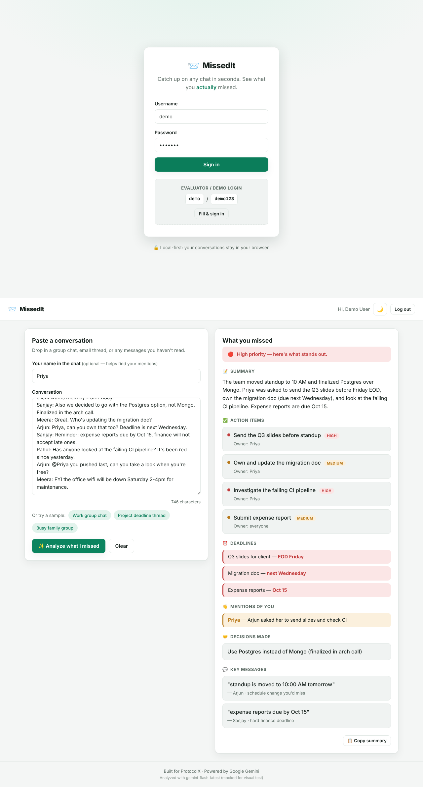

# 📨 MissedIt — "What Did I Miss?"

An AI micro-app that reads an overwhelming chat conversation and instantly tells you
**what you missed**: a summary, the action items assigned to you, deadlines, decisions,
and every time someone mentioned you — prioritized by urgency.

> Built for **ProtocolX** (PALS Club, BMSIT&M).
> Live demo: _add your Vercel URL here after deploying_



---

## The problem it solves

You open a group chat after a busy day. 200 unread messages. Somewhere in there is a
deadline that's yours, a task someone assigned you, and a decision that changes your work —
buried under memes and small talk. MissedIt pulls out the signal so you don't have to
scroll through the noise.

## What it does

- **Summarizes** long / unread conversations into a few plain sentences.
- **Extracts action items** with the owner and a priority (high / medium / low).
- **Finds deadlines** and the dates attached to them.
- **Highlights mentions of you** — the pings you'd regret missing.
- **Lists decisions** the group made.
- **Surfaces key messages** you shouldn't scroll past.
- **Prioritizes everything** by urgency and relevance.

## 🤖 Generative AI usage (disclosure)

This project uses **Google Gemini** (`gemini-flash-latest`, falling back to
`gemini-2.5-flash`) as its reasoning engine.

- **Where:** the serverless function [`api/analyze.js`](api/analyze.js) sends the
  conversation to the Gemini API with a structured prompt and gets back strict JSON.
- **What the AI does:** all of the understanding — summarizing, extracting tasks /
  deadlines / mentions, and assigning priority. There are **no canned or mocked
  responses**; every analysis is a live model call.
- **How it's prompted:** the model is instructed to use only the supplied conversation,
  never to invent facts, and to return JSON matching a fixed schema (low temperature for
  consistency). See `buildPrompt()` in `api/analyze.js`.

The sample conversations in [`samples.js`](samples.js) are **inputs** you can load to try
the app quickly — they are still analyzed live by Gemini, not pre-written results.

## 🔒 Local-first & privacy

- Your conversation is held **in your browser** and sent **only** to your own serverless
  function, which forwards it to Gemini for analysis. It is never stored on any database
  or server — nothing is persisted after the request.
- Your **Gemini API key stays on the server** (as a Vercel environment variable) and is
  never shipped to the browser.
- Theme preference is the only thing kept locally (in `localStorage`).

## 🛠️ Tech & architecture

No framework, no build step — just clean, modular vanilla JavaScript so the code is easy
to read and review.

```
missedit/
├── index.html          # markup + structure (semantic, accessible)
├── styles.css          # design system via CSS variables, light + dark themes
├── app.js              # controller: wires DOM to the modules below
├── auth.js             # demo sign-in / session handling
├── api-client.js       # calls our own /api/analyze endpoint
├── render.js           # turns the AI's JSON into DOM (with HTML-escaping)
├── samples.js          # realistic sample conversations to try
├── api/
│   └── analyze.js      # serverless fn: the real Gemini call + JSON hardening
├── test/
│   └── analyze.test.mjs# unit tests for the parsing / normalizing logic
├── vercel.json
└── package.json
```

**Why this split?** Each file has one job (auth, rendering, API, samples, orchestration).
That keeps every file short, readable, and testable — and makes the data flow obvious:
`app.js → api-client.js → api/analyze.js → Gemini → render.js`.

## ▶️ Run it locally

You need [Node.js](https://nodejs.org) installed.

```bash
# 1. Install the Vercel CLI (one time)
npm i -g vercel

# 2. From the project folder, add your Gemini key for local dev
#    (get a free key at https://aistudio.google.com/apikey)
echo "GEMINI_API_KEY=your_key_here" > .env.local   # or: vercel env add

# 3. Start the local dev server (serves the site AND the /api function)
vercel dev
```

Open the URL it prints (usually `http://localhost:3000`).

Run the tests:

```bash
node test/analyze.test.mjs
```

## 🔑 Demo / evaluator login

| Username | Password |
|----------|----------|
| `demo`   | `demo123`|

There's also a **"Fill & sign in"** button on the login screen that logs you straight in,
so you can test every feature in one click.

## ☁️ Deploy (Vercel)

1. Push this repo to GitHub (public).
2. On [vercel.com](https://vercel.com), **Add New → Project → Import** your repo.
3. In **Settings → Environment Variables**, add `GEMINI_API_KEY` = your key.
4. **Deploy.** Your live link is ready. (Full beginner guide: `DEPLOY.md`.)

## License

MIT
